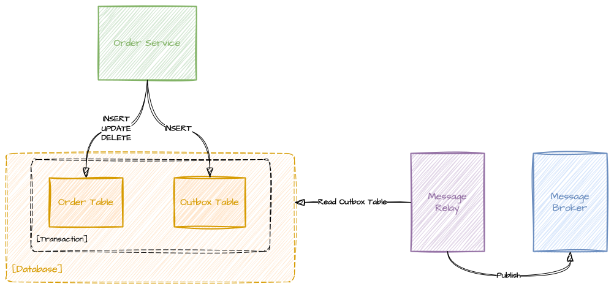
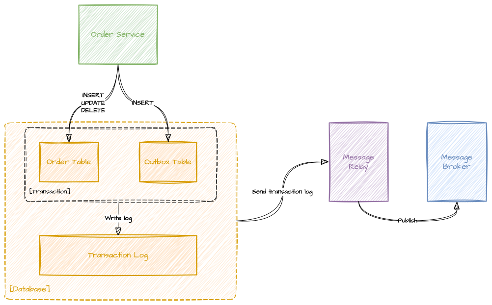

# Message Relay Patterns

This repository contains simple educational examples of the [Polling Publisher](https://microservices.io/patterns/data/polling-publisher.html) and [Transaction Log Tailing](https://microservices.io/patterns/data/transaction-log-tailing.html) patterns.

## Motivation

After reading an article about [Transactional Outbox](https://microservices.io/patterns/data/transactional-outbox.html) pattern on microservices.io, I discorvered that there are no good educational examples of the [Transaction Log Tailing](https://microservices.io/patterns/data/transaction-log-tailing.html) and [Polling Publisher](https://microservices.io/patterns/data/polling-publisher.html) patterns on either the website or GitHub.
So this repository tries to fill that gap by providing simple examples of these patterns in Python using PostgreSQL as the database and Kafka as the message broker.

## Requirements

- Read articles on microservices.io about [Transactional Outbox](https://microservices.io/patterns/data/transactional-outbox.html), [Transaction Log Tailing](https://microservices.io/patterns/data/transaction-log-tailing.html) and [Polling Publisher](https://microservices.io/patterns/data/polling-publisher.html).
- Minimal knowledge of Python to understand the examples.
- Docker and Docker Compose installed on your machine to run the examples.

## Installing

If you want to run the examples, clone the repository and open it in your terminal:

```bash
git clone https://github.com/bakhoraliev/message-relay-patterns
cd message-relay-patterns
```

## Polling Publisher



[Polling Publisher](https://microservices.io/patterns/data/polling-publisher.html) is simplest way to implement Message Relay and there is how it works:
1. The Application(Order Service) writes messages to the database in an Outbox Table.
2. Message Relay polls the Outbox Table for new messages and publishes them to the Message Broker(Kafka).
3. Once the messages are published, they are deleted from the Outbox Table or soft-deleted by setting a flag.

Simplicity of this pattern is its main advantage, but it has some drawbacks:
- It can lead to increased load on the database due to frequent polling.
- If you scale the Message Relay horizontally:
  - You need to ensure that each instance polls a different subset of the Outbox Table to avoid duplicate message processing.
    > In case of SQL databases, you can use SELECT ... FOR UPDATE SKIP LOCKED to achieve this. 
  - You lost the guarantee that messages are processed in the order they were written to the Outbox Table, because each instance may process messages independently.

## Transaction Log Tailing



[Transaction Log Tailing](https://microservices.io/patterns/data/transaction-log-tailing.html) is a more advanced pattern that uses the database's transaction log to capture changes and publish them to the Message Broker(Kafka):
1. The Application(Order Service) writes messages to the database in an Outbox Table.
2. The Message Relay reads the transaction log of the database to capture changes made to the Outbox Table.
3. The Message Relay publishes the captured changes to the Message Broker(Kafka).
  
This pattern has several advantages:
- It eliminates the need for polling, reducing the load on the database.
- Lowers the latency of message delivery, as changes are captured in real-time.
  
This pattern also has some drawbacks:
- It requires platform-specific configuration, such as enabling logical replication in PostgreSQL and using a plugin like wal2json.
- It can be more complex to implement and maintain compared to the Polling Publisher pattern.
- It can't be scaled horizontally well, because each instance of the Message Relay reads the same transaction log and processes messages in the order they were written to the Outbox Table and there is no mechanism in transaction log to skip already processed messages.

## Links
- Original articles on microservices.io:
  - https://microservices.io/patterns/data/transactional-outbox.html
  - https://microservices.io/patterns/data/transaction-log-tailing.html
  - https://microservices.io/patterns/data/polling-publisher.html
- PostgreSQL documentation on Logical Replication: https://www.postgresql.org/docs/current/logical-replication.html
- wal2json plugin: https://github.com/eulerto/wal2json

## Contributing

Contributions are welcome! If you have suggestions for improvements or new features, please open an issue or submit a pull request.
Remember that this repository is primarily for educational purposes, and aim to keep the examples simple and easy to understand.

## License

The code in this project is licensed under [The Unlicense](https://unlicense.org/) license.
